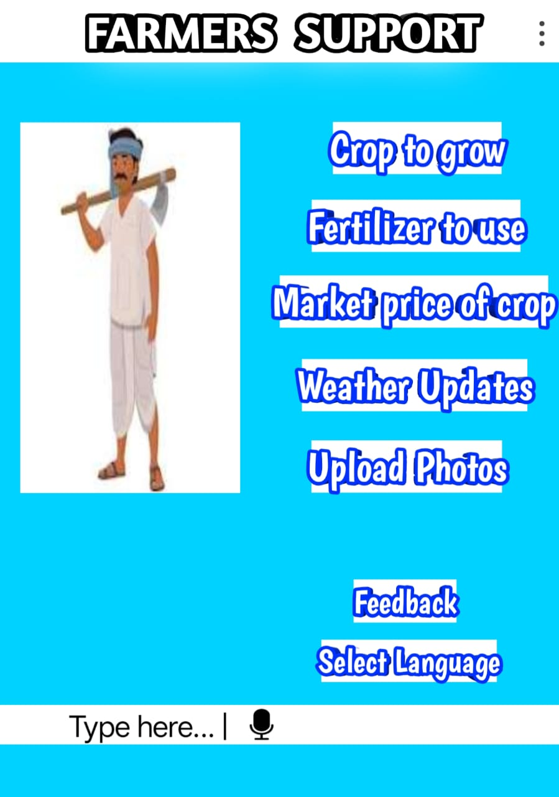

# Smart India Hackathon Workshop
# Date: 25.09.2025
## Register Number: 25010152
## Name: Sifiz A
## Problem Title
SIH 25010: Smart Crop Advisory System for Small and Marginal Farmers
## Problem Description
A majority of small and marginal farmers in India rely on traditional knowledge, local shopkeepers, or guesswork for crop selection, pest control, and fertilizer use. They lack access to personalized, real-time advisory services that account for soil type, weather conditions, and crop history. This often leads to poor yield, excessive input costs, and environmental degradation due to overuse of chemicals. Language barriers, low digital literacy, and absence of localized tools further limit their access to modern agri-tech resources.

Impact / Why this problem needs to be solved

Helping small farmers make informed decisions can significantly increase productivity, reduce costs, and improve livelihoods. It also contributes to sustainable farming practices, food security, and environmental conservation. A smart advisory solution can empower farmers with scientific insights in their native language and reduce dependency on unreliable third-party advice.

Expected Outcomes

• A multilingual, AI-based mobile app or chatbot that provides real-time, location-specific crop advisory.
• Soil health recommendations and fertilizer guidance.
• Weather-based alerts and predictive insights.
• Pest/disease detection via image uploads.
• Market price tracking.
• Voice support for low-literate users.
• Feedback and usage data collection for continuous improvement.

Relevant Stakeholders / Beneficiaries

• Small and marginal farmers
• Agricultural extension officers
• Government agriculture departments
• NGOs and cooperatives
• Agri-tech startups

Supporting Data

• 86% of Indian farmers are small or marginal (NABARD Report, 2022).
• Studies show ICT-based advisories can increase crop yield by 20–30%.

## Problem Creater's Organization
Government of Punjab

## Theme
Agriculture, FoodTech & Rural Development

## Proposed Solution
My solution is a mobile app that helps farmers.
It gives advice on which crop to grow.
Tells what fertilizer to use.
Shows weather updates.
Farmers can upload photos of pests, and the app will tell what disease it is.
It also shows market prices of crops.
Farmers can hear the advice in their own language using voice option.
This way, farmers don’t have to depend on shopkeepers or guesswork.

## Technical Approach
I will make an Android app (since most farmers use Android phones).
A server will be used to store farmer details and give answers.
A database will keep soil, crop, and price information.
The app will use:
Weather API (to get weather updates).
Market price API.
Camera option (for pest detection).
Farmer opens app and asks question / uploads photo.Then the server checks data and the app gives answer in local language.

## Feasibility and Viability
Farmers now have smartphones, so they can use this app.
Government also supports digital agriculture, so this idea is possible.

Challenges:
Internet may not be there in villages. So we can keep some info offline.
Some farmers don’t know how to read.So I will add voice support.

## Impact and Benefits
Farmers get correct information and the crop yield increases.
They save money by using right fertilizer.
Farming becomes more eco-friendly with less chemical use.
Farmers earn better income.

## Research and References
https://www.tnagrisnet.tn.gov.in/people_app/dashboard/main/en
https://medium.com/clique-org/react-js-and-spring-boot-farmer-friendly-web-app-d0af6bb9b3a8